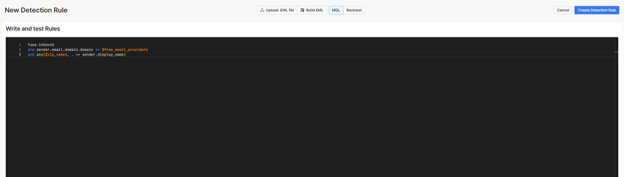
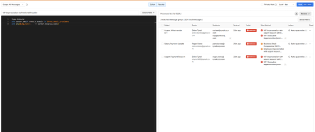
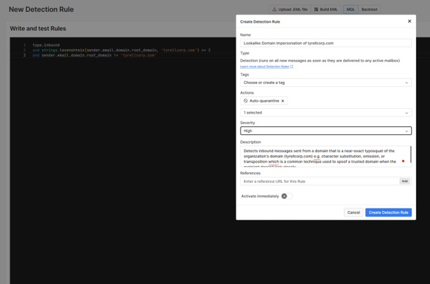
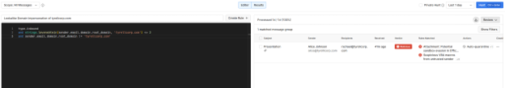
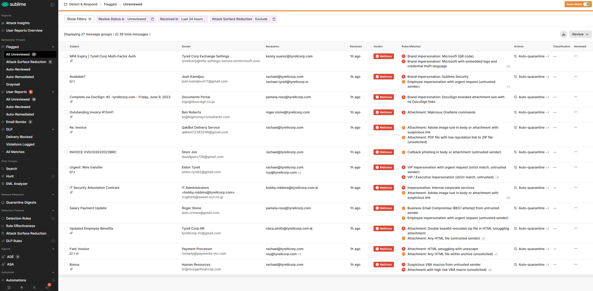

# Phishing Detection Engineering with Sublime Security

Self-hosted deployment of [Sublime Security](https://github.com/sublime-security/sublime-platform) — an open-source email detection-and-response platform — with two original detection rules written in MQL (Message Query Language) to catch executive impersonation and lookalike-domain phishing attacks. Both rules were validated against a realistic phishing message corpus.

## Table of Contents

- [Overview](#overview)
- [Why This Project](#why-this-project)
- [Architecture / Setup](#architecture--setup)
- [Detection Rule 1: VIP Impersonation via Free Email Provider](#detection-rule-1-vip-impersonation-via-free-email-provider)
- [Detection Rule 2: Lookalike Domain Impersonation](#detection-rule-2-lookalike-domain-impersonation)
- [Testing & Validation](#testing--validation)
- [Screenshots](#screenshots)
- [Skills Demonstrated](#skills-demonstrated)
- [Next Steps](#next-steps)

## Overview

Most write-ups about phishing focus on triaging alerts after the fact. This project sits on the other side of that workflow: standing up the detection platform itself and writing the rules that generate the alerts in the first place.

Two original MQL rules were built, each targeting a different attack technique:

1. **Display-name impersonation** — a spoofed executive name sent from a free email provider (classic CEO fraud / BEC pattern).
2. **Domain-level spoofing** — a typosquatted sender domain that closely resembles the organization's real domain.

Both were tested against a realistic message corpus and correctly flagged matching attacks.

## Why This Project

Writing detection logic — not just responding to it — is a core skill for security analysts who own phishing/BEC triage and want to tune or extend their organization's detection stack rather than only work tickets. This project demonstrates that skill end-to-end: platform deployment, rule design, query language proficiency, and result validation (including catching and correctly diagnosing what initially looked like a false positive).

## Architecture / Setup

- Deployed a self-hosted instance of Sublime Security via Docker, run inside WSL2 (Ubuntu) on Windows.
- Resolved environment issues along the way: a shell incompatibility (dash vs. bash) in the install script, a bot-protection block on the platform's convenience install URL (worked around by pulling the install script directly from GitHub), and Docker Desktop's WSL2 integration needing to be explicitly enabled for the Docker CLI to be reachable from the Linux distro.
- Loaded the platform's built-in **Demo Mode** dataset, which simulates a realistic organization with pre-flagged phishing, BEC, and impersonation sample messages, and reviewed the existing rule library to learn MQL syntax and conventions before writing original rules.

## Detection Rule 1: VIP Impersonation via Free Email Provider

**Custom list — `vip_names`** (String List): a roster of executive names to protect against impersonation.

**Rule description:** Detects inbound messages where the sender's display name matches a known VIP/executive, but the message is sent from a free email provider (e.g. Gmail, Outlook) rather than the organization's domain — a common pattern in CEO fraud and executive impersonation attacks.

```
type.inbound
and sender.email.domain.domain in $free_email_providers
and any($vip_names, . == sender.display_name)
```

- **Severity:** High
- **Action:** Auto-quarantine

## Detection Rule 2: Lookalike Domain Impersonation

**Rule description:** Detects inbound messages sent from a domain that is a near-exact typosquat of the organization's real domain — character substitution, omission, or insertion — a common technique used to spoof a trusted domain when the recipient doesn't look closely.

```
type.inbound
and strings.levenshtein(sender.email.domain.root_domain, 'tyrellcorp.com') <= 2
and sender.email.domain.root_domain != 'tyrellcorp.com'
```

- **Severity:** High
- **Action:** Auto-quarantine

This rule uses `strings.levenshtein()` (edit-distance) to flag any sending domain within 2 character edits of the protected domain, while explicitly excluding exact matches so legitimate mail isn't flagged.

## Testing & Validation

Both rules were run using Sublime's **Hunt** feature, which executes a rule's query against the full message corpus and returns every match.

**Rule 1 results:**

| Subject | Sender Display Name | Sender Address | Verdict |
|---|---|---|---|
| Urgent: Wire transfer | Eldon Tyrell | eldon.tyrell2@gmail.com | Malicious |
| Urgent Payment Request | Eldon Tyrell | eltyre1983@gmail.com | Malicious |
| Salary Payment Update | Roger Stone | doin.crimes@gmail.com | Malicious |

3 matched message groups / 6 total messages — all genuine impersonation attempts. No legitimate messages were caught.

**Rule 2 results — including a debugging detour:**

Hunting with Rule 2 returned a match from `alice@tyrellcorp.com`, which initially looked like a false positive since that appeared to be the legitimate domain. Investigation:

1. First suspected a typo in the rule's exclusion clause (an earlier edit had accidentally appended stray characters), corrected it, and re-ran the hunt. The match persisted.
2. Rather than assume a platform bug, compared the actual sender address character-by-character against the protected domain.
3. Found the real cause: the sender's domain was `tyrelllcorp.com` — three L's — a one-character insertion typosquat of `tyrellcorp.com`. Levenshtein distance = 1, well within the rule's `<= 2` threshold, and visually almost indistinguishable in a table view.

The rule was working correctly the entire time — it caught a genuinely disguised typosquat domain that a human reviewer could easily miss at a glance.

## Screenshots

**Rule 1 — VIP Impersonation via Free Email Provider**




**Rule 2 — Lookalike Domain Impersonation**




**Dashboard / demo org overview**



## Skills Demonstrated

- Detection engineering: writing and validating two original phishing/BEC detection rules from scratch in MQL
- Email security platform administration: deploying and operating a self-hosted security tool via Docker
- Threat pattern knowledge: applying executive impersonation / CEO fraud and typosquat-domain TTPs to design detection logic
- Linux/WSL2 troubleshooting: diagnosing shell, networking, and container-runtime issues during deployment
- Query language proficiency: list-based matching, lambda-style predicates (`any()`), string edit-distance functions (`levenshtein()`), and inbound message scoping in MQL
- Detection validation methodology: treating an unexpected match as a hypothesis to investigate rather than assuming a tool error, and tracing a flagged result back to root cause before concluding whether a rule was correct or buggy

## Next Steps

- Negative testing: confirm legitimate internal emails from the listed executives and from the real organization domain do not trigger either rule.
- Tune severity/action thresholds based on a larger sample of benign mail.
- Add a third rule targeting a content- or link-based technique (e.g. credential-phishing URL patterns) to round out coverage across sender-identity, domain, and content-based detection.
